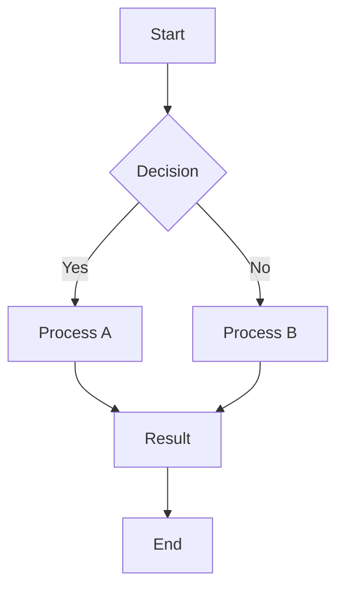
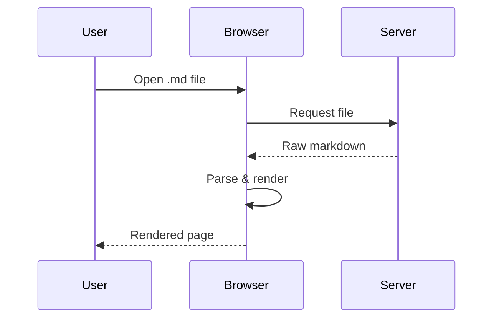
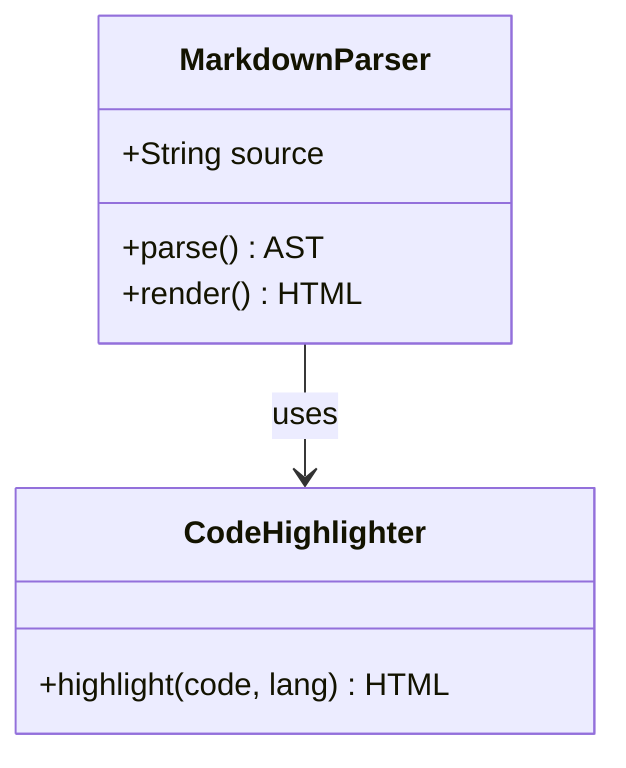
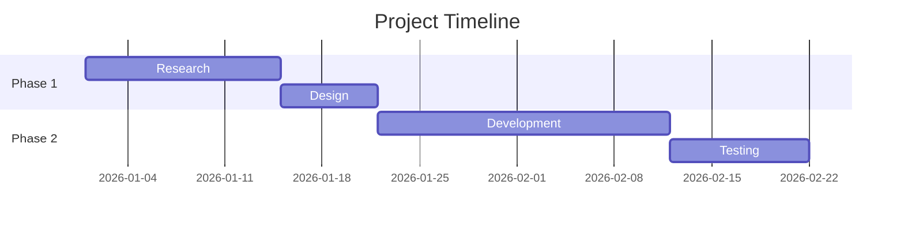

# Heading 1

## Heading 2

### Heading 3

#### Heading 4

##### Heading 5

###### Heading 6

## Paragraphs & Inline

This is a paragraph with **bold**, *italic*, ***bold italic***, ~~strikethrough~~, and `inline code`. Here's a [link](https://example.com) and an .

This paragraph has a line break right here
and continues on the next line (testing `breaks: true`).

Hard paragraphs are separated by blank lines. This is a separate paragraph with some ~subscript~ and ^superscript^ attempts, plus a ==highlight== test.

## Blockquotes

> Single-level blockquote.

> Nested blockquote:
>
> > Second level.
> >
> > > Third level with **bold** inside.

## Lists

### Unordered

- Item one
- Item two
  - Nested item
  - Another nested
    - Deep nested
- Item three

### Ordered

1. First
2. Second
   1. Sub-item
   2. Sub-item
3. Third

### Task List

- [x] Completed task
- [ ] Incomplete task
- [x] Another done
- [ ] Still pending

### Definition List

Term 1
: Definition for term 1

Term 2
: Definition for term 2
: Alternative definition

## Code Blocks

Inline: `const x = 42;`

```javascript
function greet(name) {
  console.log(`Hello, ${name}!`);
  return { greeting: `Hi ${name}`, timestamp: Date.now() };
}
```

```python
def fibonacci(n: int) -> list[int]:
    """Generate fibonacci sequence."""
    a, b = 0, 1
    result = []
    for _ in range(n):
        result.append(a)
        a, b = b, a + b
    return result
```

```css
.markdown-body {
  font-family: -apple-system, BlinkMacSystemFont, "Segoe UI", sans-serif;
  line-height: 1.6;
  max-width: 48rem;
  margin: 0 auto;
}
```

```bash
#!/bin/bash
for file in *.md; do
  echo "Processing: $file"
  wc -w "$file"
done
```

```
Plain code block without language specified.
Just raw preformatted text.
```

## Tables

| Feature       | Supported | Notes                  |
|---------------|:---------:|------------------------|
| GFM tables    |    Yes    | With alignment         |
| Left-aligned  | Yes       | Default                |
| Center        |    Yes    | Using `:---:`          |
| Right-aligned |       Yes | Using `---:`           |

| Method   | Endpoint         | Status |
|----------|------------------|--------|
| `GET`    | `/api/users`     | 200    |
| `POST`   | `/api/users`     | 201    |
| `DELETE` | `/api/users/:id` | 204    |

## Links & References

- [Inline link](https://example.com)
- [Link with title](https://example.com "Example Site")
- [Reference link][ref1]
- Autolink: https://example.com
- Email: <user@example.com>

[ref1]: https://example.com/reference "Reference"

## Images


## Horizontal Rules

---

***

___

## HTML Elements

<details>
<summary>Click to expand</summary>

This content is hidden by default. It can contain **markdown** too.

- List inside details
- Another item

</details>

<div style="background: #f0f0f0; padding: 1em; border-radius: 4px;">
  <strong>HTML div</strong> with inline styles.
</div>

<kbd>Ctrl</kbd> + <kbd>Shift</kbd> + <kbd>P</kbd>

<mark>Highlighted text using mark element</mark>

<abbr title="Hypertext Markup Language">HTML</abbr> abbreviation.

## Mermaid Diagrams

### Flowchart



### Sequence Diagram



### Class Diagram



### Gantt Chart



## Footnotes

This sentence has a footnote[^1] and another one[^2].

[^1]: First footnote content.
[^2]: Second footnote with **formatting** and `code`.

## Math (if supported)

Inline math: $E = mc^2$

Block math:

$$
\frac{-b \pm \sqrt{b^2 - 4ac}}{2a}
$$

## Escaping & Edge Cases

\*Not italic\* and \**not bold\**

Emoji shortcodes: :smile: :rocket: :tada:

Unicode emoji: 🎉 🚀 😊

Long unbroken text: aaaaaaaaaaaaaaaaaaaaaaaaaaaaaaaaaaaaaaaaaaaaaaaaaaaaaaaaaaaaaaaaaaaaaaaaaaaaaaaaaaaaaaaaaa

> Blockquote with `code`, **bold**, and a [link](https://example.com)

Nested formatting: **bold with *italic* inside** and *italic with **bold** inside*
